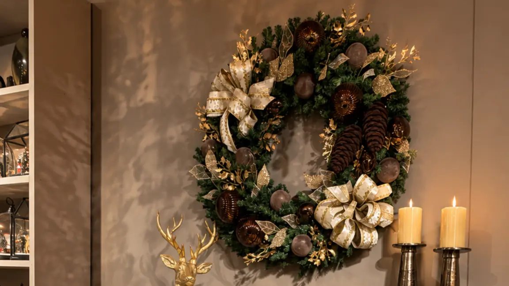
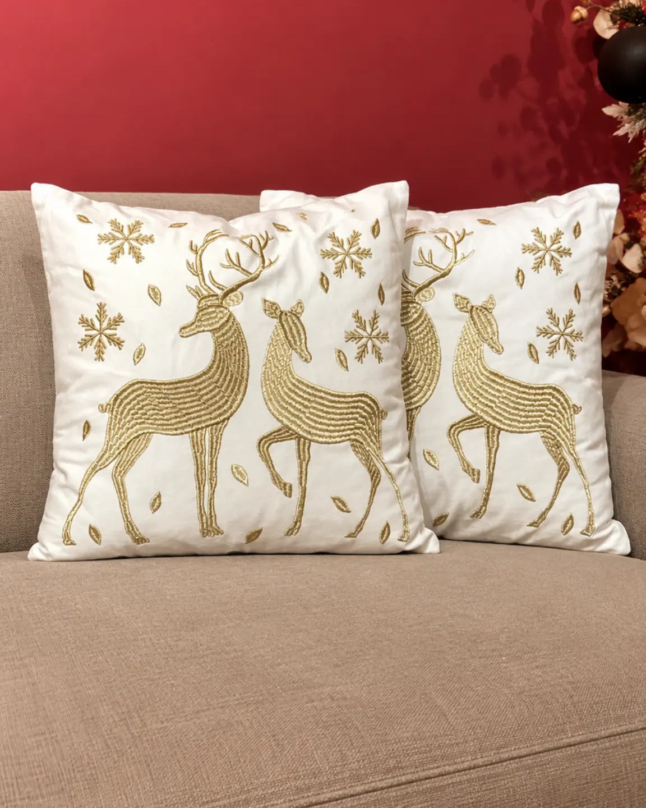
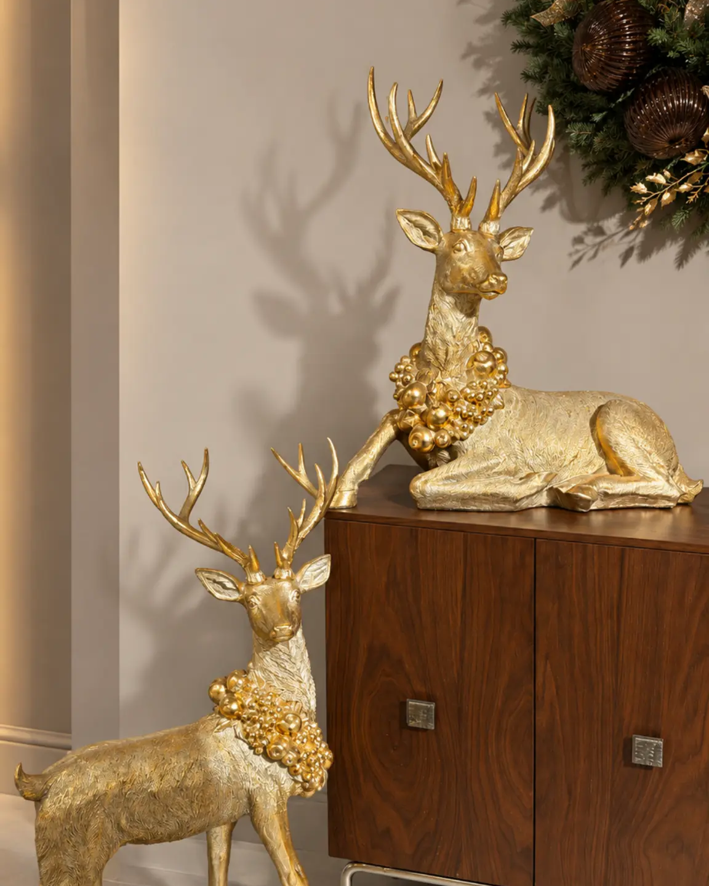
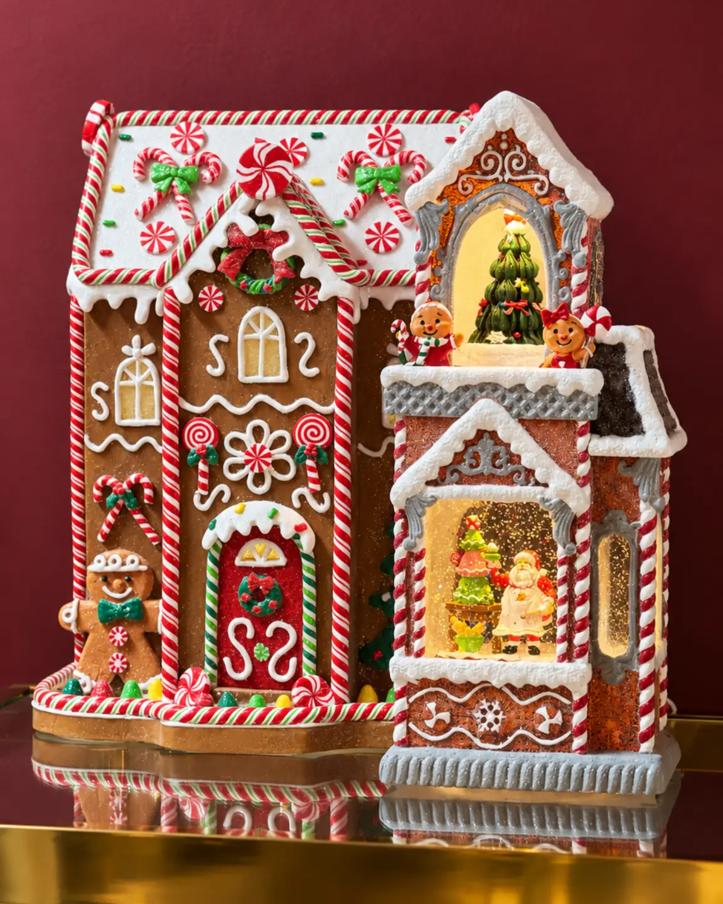

# Decoración de Navidad: guía para crear espacios equilibrados

<figure class="hero">
  
  <figcaption>Una composición que relaciona pared, aparador y suelo puede conectar el lenguaje navideño de distintos puntos del hogar.</figcaption>
</figure>

<!-- INICIO CUERPO -->
## Introducción

La decoración de Navidad funciona mejor cuando cada pieza tiene una relación clara con el espacio. Antes de elegir adornos, observa la arquitectura, las superficies disponibles y los recorridos cotidianos. Así, la casa conserva su comodidad y la temporada aparece como una capa coherente, no como una acumulación de objetos.

Esta guía reúne criterios para sala, comedor, recibidor, cocina, repisas y otros rincones. El propósito no es imponer un estilo único, sino ayudarte a decidir qué destacar, cuánto espacio dejar libre y cómo conectar los ambientes. La decoración para Navidad puede sentirse tradicional, sobria o luminosa, siempre que mantenga una lógica de color, escala y uso.

## Empieza por un concepto y una paleta

Define primero la sensación que quieres construir. Una composición tradicional puede apoyarse en rojo, verde y acentos metálicos. Una propuesta más serena puede reducirse a dos colores principales y un acabado de apoyo. No es necesario repetir todos los objetos: basta con trasladar una decisión visual a distintos puntos de la casa para que exista continuidad.

Elige una pieza de referencia antes de llenar las superficies. Puede ser el árbol de la sala, una villa en una repisa o un nacimiento en un lugar significativo. Después selecciona apoyos que respeten su presencia. Si cada elemento compite por atención, las ideas de decoración de Navidad pierden dirección.

La proporción guía la selección. En una sala amplia, una pieza vertical puede sostener el volumen del lugar. En una consola estrecha, una escena baja conserva la profundidad útil. En una composición pequeña, agrupa pocos objetos con alturas diferentes y deja zonas de descanso visual. Estos principios complementan la guía permanente sobre [equilibrio, proporción y color para una sala](https://anbarhome.co/blog/como-decorar-una-sala-sin-recargarla), pero aquí se aplican a una ambientación estacional.

## Cómo distribuir la decoración por espacios

### Sala: un punto focal y varios apoyos

En la sala, decide cuál será el centro de atención. Un árbol puede ocupar una esquina libre o acompañar una ventana sin bloquear puertas ni zonas de paso. Revisa su altura respecto al techo y su ancho respecto a los muebles. Un formato estilizado puede resolver la presencia vertical cuando la habitación necesita conservar aire alrededor.

Completa el conjunto con apoyos de menor escala. Una consola puede recibir una villa, un pesebre o una figura, mientras la mesa de centro puede llevar una composición baja. Evita poner todos los objetos frente al árbol: distribuye algunos elementos en laterales o repisas. La colección de árboles de Anbar Home puede consultarse al final del artículo para comparar formatos sin convertir esta guía en un catálogo.

<figure class="article-image">
  
  <figcaption>Los textiles pueden repetir color y motivo en la sala sin convertir cada superficie en un punto focal.</figcaption>
</figure>

### Comedor: ambiente sin sacrificar conversación

En el comedor, la decoración navideña debe acompañar la reunión. Elige un punto focal sobre la mesa o en el aparador y reserva espacio para servir. Un centro de mesa de dos niveles puede aportar volumen sin extenderse por toda la superficie; ubícalo de manera que las personas puedan verse y conversar.

Una distribución sencilla concentra la pieza principal en el centro, repite un color en dos detalles laterales y deja libres los bordes de uso. En un desayunador o barra de café, una pieza para presentar alimentos puede reforzar el tema sin ocupar el área de preparación. La mesa debe seguir siendo funcional después de tomar la fotografía.

### Recibidor: bienvenida, escala y circulación

El recibidor necesita una lectura rápida y un paso despejado. Si hay consola, mide el espacio entre la pieza decorativa, la puerta y el recorrido habitual. Un elemento vertical puede funcionar en un extremo, mientras una escena baja se adapta mejor a una superficie estrecha. El espejo, la luz existente y la apertura de las puertas también forman parte de la decisión.

Prueba la composición desde la entrada y desde el interior de la casa. Si una pieza tapa un interruptor, roza el paso o sobresale del mueble, cambia su ubicación antes de sumar elementos. El primer vistazo debe sentirse ordenado y la circulación debe conservarse.

<figure class="article-image">
  
  <figcaption>Relacionar una pieza de suelo con otra sobre la consola ayuda a trabajar la escala sin invadir el recorrido.</figcaption>
</figure>

### Cocina, pasillos, repisas y vitrinas

Los espacios secundarios ganan coherencia con intervenciones puntuales. En una cocina o barra de café, una casita o villa puede crear una escena pequeña sin competir con las zonas de preparación. En un pasillo amplio, una pieza vertical debe quedar fuera de la trayectoria. En una repisa o vitrina, trabaja por niveles: coloca el elemento más alto atrás, uno o dos apoyos delante y deja un margen visible alrededor.

No es necesario decorar cada rincón. Escoger dos o tres zonas conectadas suele producir una lectura más ordenada que repartir objetos aislados por toda la casa. Esta decisión es especialmente útil en apartamentos, donde la profundidad de los muebles y la apertura de las puertas condicionan la composición.

<figure class="article-image">
  
  <figcaption>Una escena aislada puede dar carácter a una repisa o vitrina sin extender la decoración por todo el ambiente.</figcaption>
</figure>

## Pesebres y villas: escenas con un lugar propio

Los pesebres, nacimientos y villas navideñas pueden convertirse en el relato visual de un ambiente si tienen una superficie estable y una escala compatible. Un nacimiento puede ocupar una consola o un aparador reservado para la tradición familiar. Una villa puede organizarse en una repisa o vitrina con suficiente margen para que sus formas se distingan.

Evita mezclar escenas completas con muchos puntos focales en la misma superficie. Si una pieza tiene iluminación, revisa el acceso al punto de conexión y organiza el cableado sin invadir el paso. La categoría de villas navideñas es un destino comercial; el artículo, en cambio, debe explicar cómo seleccionar el lugar y equilibrar la escena.

## Conserva función y equilibrio

Antes de colocar las piezas, dibuja la zona o toma una fotografía de frente. Marca puertas, ventanas, enchufes, pasillos y superficies que deben seguir disponibles. Después define un punto focal por ambiente y uno o dos apoyos. Esta secuencia evita disponer objetos sin un destino claro.

Observa la decoración de día y de noche. La luz natural muestra la escala y las sombras; la iluminación existente revela si ciertos brillos compiten con la actividad del espacio. Mantén estable aquello que pueda caer con un roce y no tapes salidas, ventilaciones ni zonas de trabajo. En hogares con niños o mascotas, considera qué elementos quedan a su alcance.

## Errores frecuentes

Decorar por acumulación no crea necesariamente una composición. Retira una pieza y revisa si el conjunto respira. También es frecuente ignorar la escala: un elemento pequeño se pierde en una sala amplia y uno grande comprime una consola estrecha. Mezclar demasiadas paletas rompe la continuidad, mientras bloquear recorridos afecta la vida diaria. Finalmente, concentrar todo en la sala deja sin relación el comedor, el recibidor y los rincones de apoyo. La solución es repartir el tema con moderación.

## Preguntas frecuentes

### ¿Cómo decorar la casa en Navidad sin que se vea recargada?

Selecciona un punto focal por ambiente, limita la paleta y deja superficies libres para su uso habitual. Repetir un color o acabado conecta mejor los espacios que sumar adornos sin relación.

### ¿Qué espacio conviene decorar primero?

Empieza por el ambiente que más se usa o que se ve desde la entrada. Allí puedes definir el lenguaje visual y trasladar algunos tonos al comedor, al recibidor y a otros rincones.

### ¿Cómo elegir el tamaño de un árbol para la sala?

Mide la altura disponible, el ancho de la esquina y el recorrido cercano. El árbol debe conservar puertas y pasillos libres; en espacios angostos, un formato estilizado puede resolver la presencia vertical con menor huella.

### ¿Qué puedo usar en una consola o repisa?

Escoge una escena o pieza principal y acompáñala con elementos de menor altura. Villas, pesebres o figuras pueden funcionar si la base es estable y queda margen para limpiar y circular.

### ¿Cómo integrar comedor y sala sin repetir la misma decoración?

Comparte una paleta o un acabado, pero cambia la función. La sala puede concentrar altura y volumen, mientras el comedor prioriza una pieza baja y central que permita conversar y servir.

## Cierre y CTA

Una buena decoración de Navidad no depende de llenar todos los espacios. Depende de elegir relaciones claras entre escala, color, función y recorrido. Recorre la casa, decide qué quieres destacar y deja que cada ambiente tenga su propio ritmo. Para explorar escenas que puedan integrarse a repisas, consolas o vitrinas, consulta las [Villas navideñas de Anbar Home](https://anbarhome.co/category/villas-navidenas).
<!-- FIN CUERPO -->
