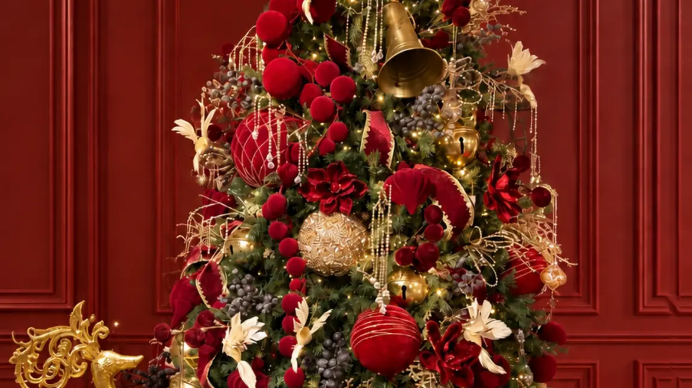
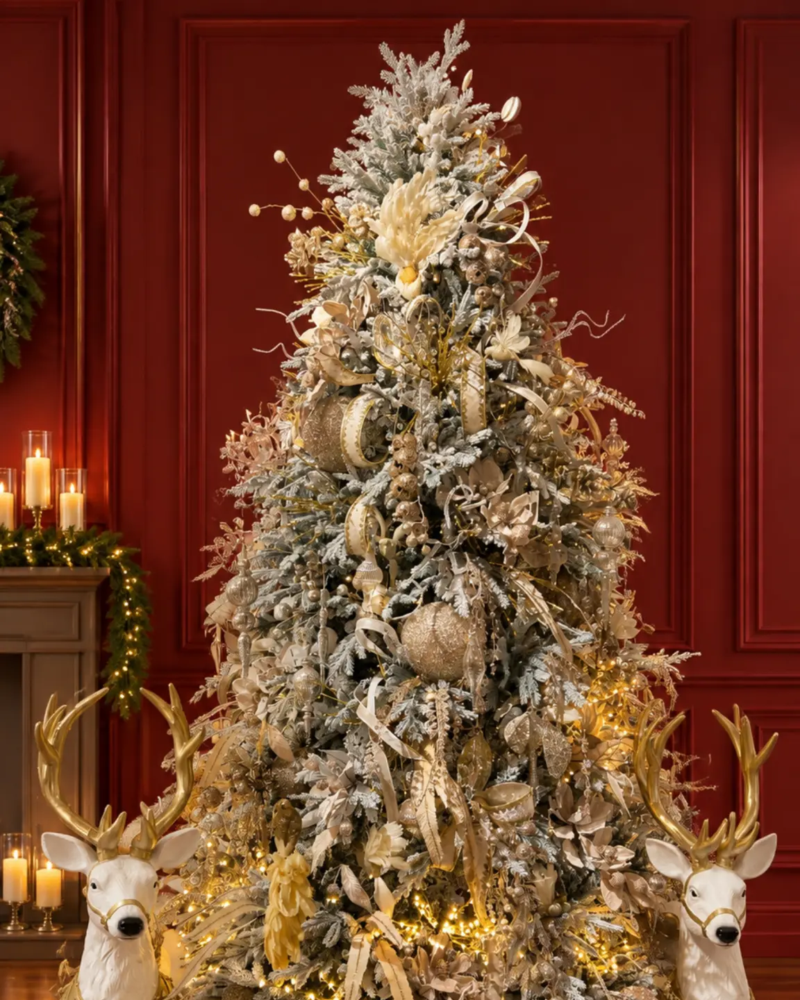
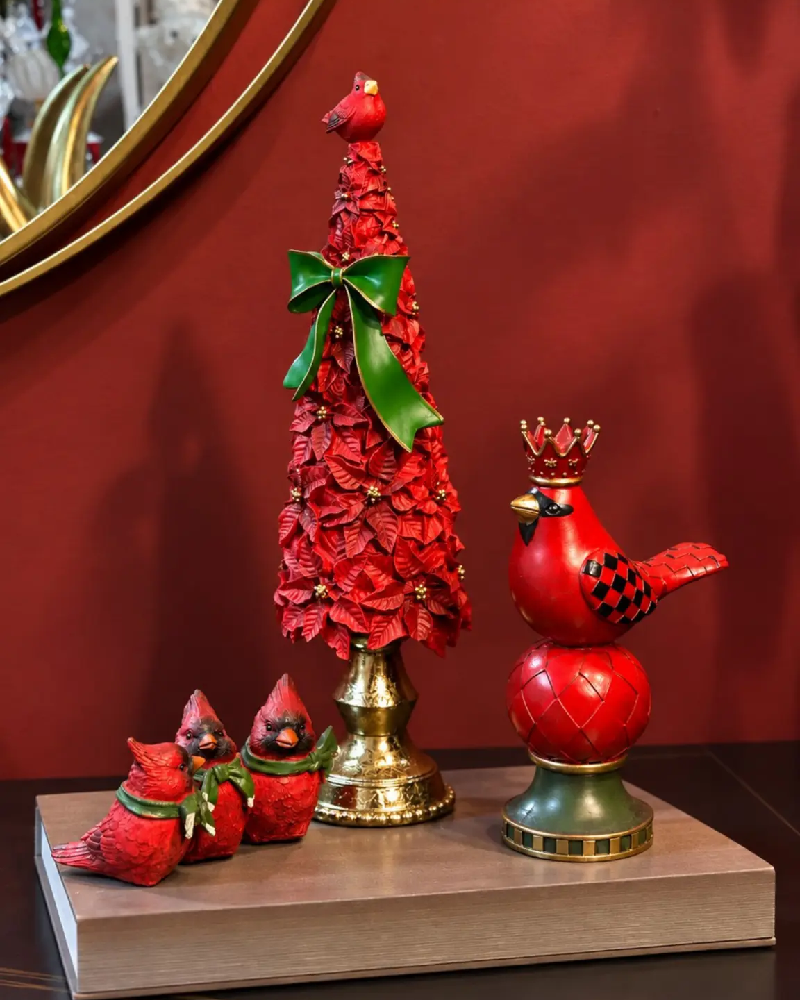

# Decoración de árbol de Navidad: guía de proporción y color

<figure class="hero">
  
  <figcaption>Una paleta corta y una jerarquía clara ayudan a que la decoración del árbol se lea como un conjunto.</figcaption>
</figure>

<!-- INICIO CUERPO -->
## Introducción

Un árbol puede tener piezas llamativas y aun así verse desordenado si todos los elementos compiten por atención. La decoración de árbol de Navidad funciona mejor cuando parte de tres decisiones: qué escala necesita el ambiente, qué paleta lo conectará con la habitación y cómo se observará desde distintos ángulos. Después, cada pieza puede cumplir una función dentro de la composición.

Esta guía propone un método flexible para casas, apartamentos, lobbies y vitrinas. No impone una cantidad fija de adornos porque cada árbol, espacio y estilo tiene una densidad diferente. La meta es construir profundidad, jerarquía y equilibrio sin confundir una guía editorial con la oferta variable de una categoría comercial.

## Elige el árbol según la escala del espacio

Antes de escoger colores, observa la altura libre, el ancho disponible y la distancia de paso. Un árbol alto necesita una zona que permita leer su silueta completa. Si el lugar es estrecho, una forma estilizada puede dejar más aire a los lados. En una consola o recibidor, un árbol decorativo pequeño puede actuar como punto focal sin ocupar la circulación.

La colección de Árboles de Navidad de Anbar Home permite comparar formatos antes de decidir. Las fichas auditadas incluyen referencias como el Árbol Navideño Aspen Slim y el Árbol Navideño Alpes Nevados Alto. Sus medidas deben comprobarse en la página correspondiente y relacionarse con el espacio real; no son reglas universales para todos los ambientes.

En un apartamento, mide también la base y el espacio para abrir puertas o mover sillas. En una sala amplia o un lobby, revisa cómo se verá desde el acceso. Elegir bien significa conservar el recorrido y permitir que el árbol se lea como parte del ambiente, no como una pieza aislada.

<figure class="article-image">
  
  <figcaption>La altura y el volumen del árbol deben guardar relación con la escala arquitectónica y con los elementos que lo acompañan.</figcaption>
</figure>

## Define una paleta antes de colocar adornos

La decoración árbol Navidad se ve más cohesionada cuando eliges una paleta corta antes de empezar. Puedes partir de un color dominante y acompañarlo con uno o dos tonos de apoyo. Entre los acabados presentes en referencias auditadas aparecen dorado, plateado, champagne, rojo, cristalino, verde natural y blanco tipo nieve. La combinación final debe responder al árbol y a los colores que ya existen en la habitación.

Una paleta no significa que todas las piezas deban ser idénticas. La variedad puede venir de la textura, el brillo y la escala. En un árbol nevado, los tonos metálicos o cristalinos pueden reforzar la apariencia; en un árbol verde, el rojo puede aportar contraste y el dorado, calidez. Repetir tonos y variar acabados evita una composición plana.

## Sigue un orden de colocación

Trabajar por capas evita llenar solo el frente. Abre y separa las ramas, comprueba la estabilidad de la base y decide desde qué ángulos se observará. Después sigue este orden orientativo:

1. **Luces, si forman parte de la propuesta:** distribúyelas desde el interior hacia el exterior y sigue las indicaciones del fabricante.
2. **Cintas o guirnaldas, si están disponibles y corresponden al concepto:** deja recorridos sueltos que acompañen la silueta.
3. **Piezas grandes:** ubícalas primero para establecer ritmo y alterna alturas y caras.
4. **Piezas medianas y pequeñas:** llena vacíos sin esconder todo el follaje.
5. **Remate superior y base:** termina con un elemento proporcional y una zona inferior ordenada.

Este orden facilita corregir. Si algo se ve pesado, mueve una pieza antes de añadir otra. La decoración de Navidad árbol mejora cuando cada capa tiene una razón visible.

## Distribuye los adornos para crear profundidad

Mira el árbol como una composición tridimensional, no como una superficie plana. Coloca algunos elementos cerca del tronco y otros hacia las puntas de las ramas. La diferencia de profundidad genera sombras y hace que el conjunto se perciba más completo desde los laterales. También ayuda a que las luces se vean entre capas.

Forma pequeños grupos visuales separados entre sí. Cada grupo puede reunir tamaños distintos, pero conviene repetir su lógica en otros puntos. En vez de trazar una línea horizontal, alterna alturas y direcciones. Da una vuelta completa mientras avanzas: si la parte posterior está contra un muro, lleva algunos elementos hacia los laterales. En un lobby, una vitrina o una sala abierta, la revisión a 360 grados es indispensable.

<figure class="article-image">
  
  <figcaption>Alternar piezas cerca del tronco y hacia las puntas crea sombras y profundidad entre las capas.</figcaption>
</figure>

## Equilibra tamaños, acabados y foco

El árbol necesita jerarquía. Las piezas grandes llaman la atención y marcan el ritmo; las medianas enlazan grupos; las pequeñas aportan precisión. Distribuye los tamaños para que el peso visual no se acumule abajo ni en un solo costado. Deja que algunas ramas queden visibles porque el follaje también es parte de la composición.

El punto focal puede estar en la zona central, en el remate superior o en una combinación de color. No todos los adornos deben ser protagonistas. Si una pieza tiene mucho brillo o color intenso, acompáñala con elementos tranquilos. Navidad Premium puede funcionar como colección contextual para piezas de presencia alrededor del árbol, no como prueba de que sus objetos sean adornos para colgar en las ramas.

## Resuelve la base y revisa todos los ángulos

La base no debe verse olvidada. Mantenla visualmente limpia o relaciónala con una pieza cercana sin acumular objetos alrededor del tronco. Una base saturada compite con el árbol y puede dificultar la limpieza y la circulación. Antes de terminar, aléjate y revisa la escena con luz natural y artificial. Comprueba el remate superior, el peso de cada lado y la visibilidad desde el acceso principal.

En una sala, coordina el árbol con una consola cercana sin copiar exactamente sus tonos. En una vitrina, repite un color del escaparate y conserva zonas de descanso. En un espacio profesional, prioriza una silueta clara y un recorrido despejado.

## Ejemplos según el espacio

**Apartamento o sala compacta.** Elige una silueta que no bloquee el paso, concentra el punto focal en la zona media y deja la base despejada. Un árbol decorativo pequeño puede ser referencia para una consola o vitrina, pero no debe presentarse como sustituto universal de un árbol principal.

<figure class="article-image">
  
  <figcaption>Un formato de sobremesa puede actuar como punto focal en una superficie pequeña sin bloquear el paso.</figcaption>
</figure>

**Sala amplia.** Aprovecha la altura para crear una lectura vertical. Distribuye las piezas grandes en niveles distintos y deja que el follaje respire. La composición será más estable si guarda relación con los muebles cercanos.

**Lobby, hotel u oficina.** Define primero la zona de espera y el flujo de personas. Ubica el árbol donde pueda contemplarse sin estrechar recorridos ni ocultar señalización. Usa una paleta conectada con la identidad visual del lugar y revisa que ningún elemento se haya desplazado.

## Errores frecuentes

Colgar todo en el frente produce una imagen plana. Empezar sin paleta mezcla colores que no dialogan. Usar una sola escala elimina jerarquía; ignorar la base resta claridad. Seguir una cantidad rígida desconoce las diferencias entre espacios. Finalmente, no revisar la parte posterior deja vacíos visibles cuando el árbol se contempla desde varios accesos. Observa, corrige y solo después decide si hace falta añadir algo.

## Preguntas frecuentes

### ¿Cuál es el primer paso para decorar un árbol de Navidad?

Mide el lugar y define desde qué puntos se verá. Luego elige una paleta y prepara las ramas antes de colocar luces o adornos.

### ¿Cómo decorar un árbol pequeño sin saturarlo?

Usa una paleta reducida, deja parte del follaje visible y combina pocas piezas de tamaños relacionados. Mantén despejadas la base y la zona inmediata.

### ¿Es necesario decorar la parte posterior?

Sí, cuando se observa desde varios ángulos. Si está contra un muro, concentra el esfuerzo en los laterales visibles, pero evita un cambio brusco entre frente y espalda.

### ¿Qué va primero, las luces o los adornos?

Las luces van antes porque pueden distribuirse entre el interior y el exterior de las ramas. Después incorpora cintas o guirnaldas solo si forman parte del concepto.

### ¿Cómo combinar un árbol nevado con el ambiente?

Repite uno o dos tonos del árbol y contrasta con acabados distintos. La combinación final debe responder al espacio y no a una fórmula fija.

## Cierre y CTA

Un árbol equilibrado no depende de contar adornos. Depende de observar la escala, elegir una paleta coherente y construir profundidad con pausas visuales. Cuando la composición se revisa desde todos los ángulos, el árbol se integra al ambiente. Para comparar formatos antes de elegir, explora la [colección de Árboles de Navidad de Anbar Home](https://anbarhome.co/category/arboles-de-navidad).
<!-- FIN CUERPO -->
