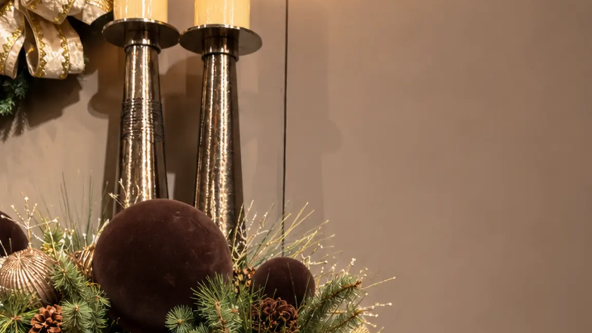
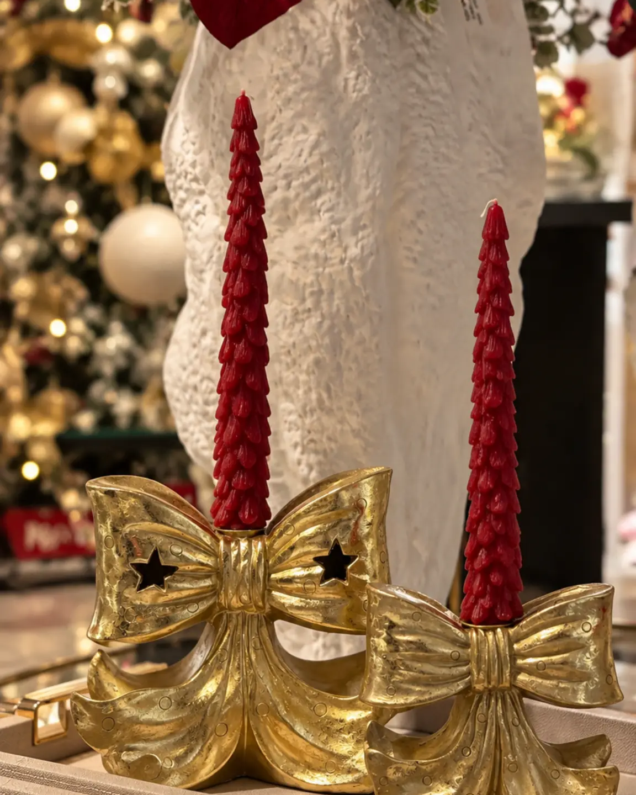
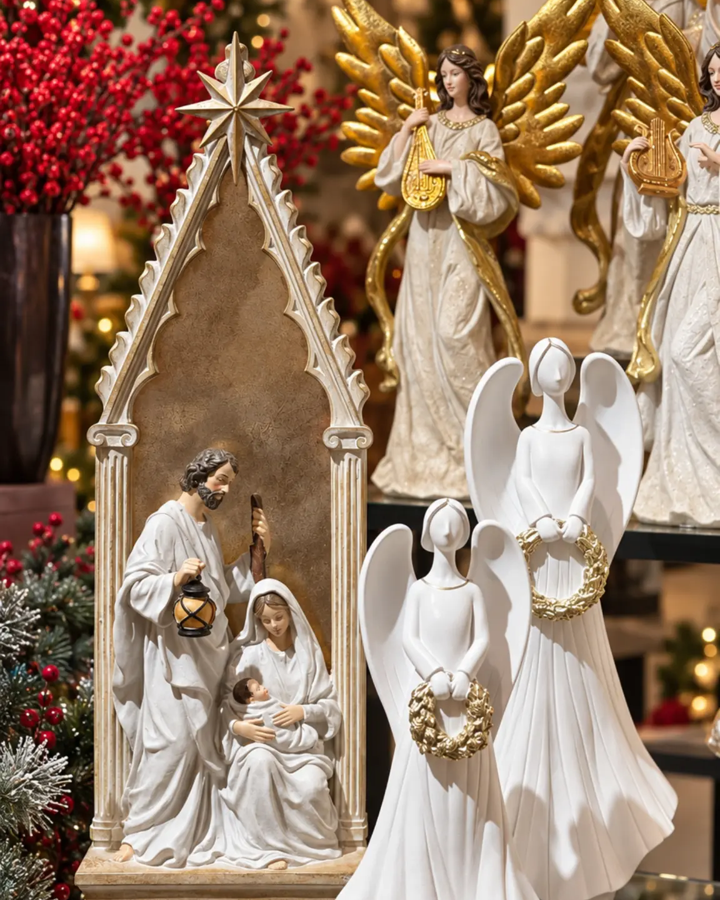
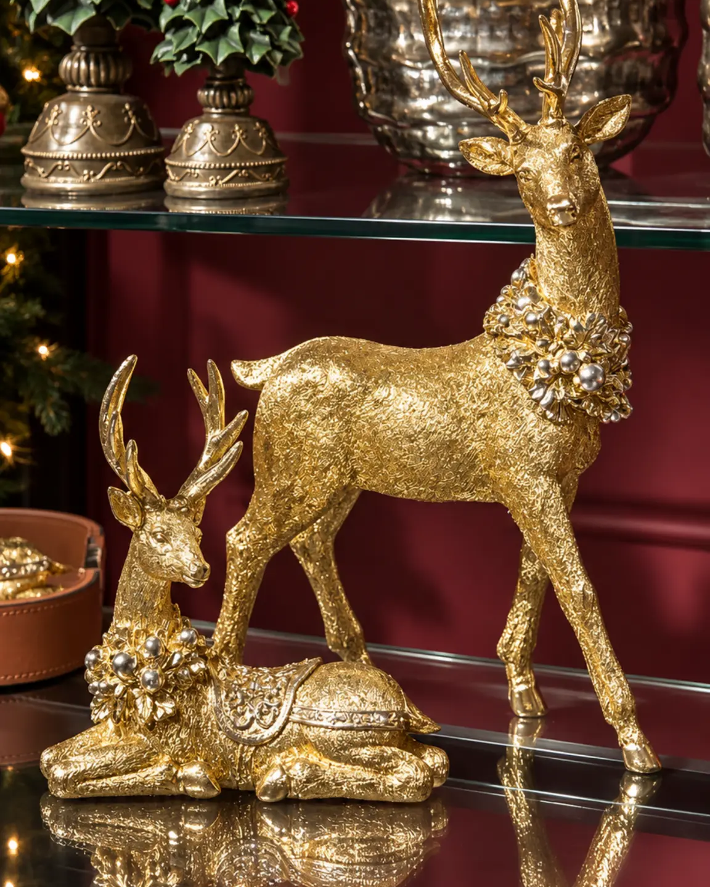

# Decoración para Navidad en espacios pequeños: ideas prácticas

<figure class="hero">
  
  <figcaption>Una superficie de apoyo bien delimitada puede concentrar la temporada y conservar libre el paso.</figcaption>
</figure>

<!-- INICIO CUERPO -->
## Introducción

Vivir en un apartamento, un estudio o una oficina pequeña no significa renunciar a una ambientación navideña con intención. La clave está en trabajar con la escala real: una superficie bien elegida puede convertirse en el punto focal sin ocupar el paso ni interferir con las actividades diarias. Conviene seleccionar pocas piezas y darles una ubicación clara.

Esta guía de decoración para Navidad en espacios pequeños propone un método práctico para decidir qué destacar, dónde ubicarlo y cómo guardar cada elemento después de la temporada. El objetivo no es hacer que el lugar parezca más grande mediante promesas, sino conservar su funcionamiento mientras se incorpora una escena de temporada.

## Empieza por leer el espacio

Antes de sacar los adornos, observa las zonas de circulación, las superficies libres y el punto que se ve primero al entrar. Puede ser una consola estrecha, una repisa, una mesa auxiliar o un mueble de recepción que no interfiera con el trabajo. Mide ancho, profundidad y altura disponible; una pieza que cabe de frente puede sobresalir demasiado hacia el paso.

### Define un solo punto focal

Elige una pieza protagonista y deja que el resto la acompañe. Un conjunto de árboles de mesa puede ordenar una consola; un centro de mesa puede estructurar un comedor compacto; una escena navideña puede dar profundidad a una repisa. Si cada superficie intenta llamar la atención, el ambiente pierde jerarquía y parece más reducido.

### Trabaja con una paleta breve

La decoración navideña para espacios pequeños se beneficia de una paleta corta. Escoge un tono base, un color de acento y un acabado que se repita con moderación. La continuidad entre el árbol de mesa, la repisa y la mesa auxiliar ayuda a que las piezas se lean como una sola historia.

Si ya hay textiles, obras de arte o muebles con presencia, integra la Navidad mediante pocos contrastes. La luz cálida puede marcar el ambiente si el cableado queda organizado y no atraviesa las zonas de paso.

## Elige el formato para cada superficie

### Árbol de piso, árbol de mesa o composición por niveles

Un árbol de Navidad para espacios pequeños no tiene que ocupar toda la altura de la habitación. Cuando el piso está comprometido, un árbol decorativo de mesa puede llevar el foco a una consola, un escritorio o una mesa auxiliar. Otra opción es un conjunto de árboles de distintas alturas: aprovecha la verticalidad y evita que todas las piezas queden alineadas.

La colección de Árboles de Navidad permite comparar formatos. Decide según la superficie disponible y la distancia de observación. Un modelo alto y estrecho puede ocupar un rincón, mientras un formato de mesa puede ir en una repisa o mueble de trabajo. Las medidas de la ficha tienen prioridad sobre etiquetas generales como “para apartamento”.

<figure class="article-image">
  
  <figcaption>Una base delimitada permite llevar el acento navideño a una superficie pequeña y retirarlo con facilidad.</figcaption>
</figure>

### Repisas, consolas y esquinas verticales

Las paredes y repisas aportan altura sin restar área útil al piso. En una consola estrecha, combina una pieza vertical con otra baja y deja una franja despejada para que el mueble conserve su función. En una repisa, distribuye los elementos en dos o tres grupos visuales sin llenar cada centímetro.

Las villas y escenas navideñas pueden aportar un relato compacto. En lugares angostos, prioriza objetos de frente controlado y revisa que no sobresalgan del borde del mueble. Una escena completa necesita margen para que se distinga; no la escondas entre muchos apoyos.

<figure class="article-image">
  
  <figcaption>Una escena vertical puede convertir una repisa en un punto focal sin ocupar el área útil del piso.</figcaption>
</figure>

## Cuatro distribuciones posibles

### 1. Sala de apartamento con consola estrecha

Ubica el árbol de mesa o un conjunto compacto en un extremo de la consola. En el lado opuesto incorpora un elemento más bajo y deja el frente libre hacia el sofá o la puerta. La composición debe poder retirarse para limpiar sin obligar a mover todo el mueble. Para ampliar los criterios permanentes de escala, consulta [cómo decorar una sala sin recargarla](https://anbarhome.co/blog/como-decorar-una-sala-sin-recargarla), sin duplicar allí el contenido navideño.

### 2. Estudio con repisa y escritorio

Reserva la superficie de trabajo para lo esencial. Lleva la composición a una repisa cercana y usa un elemento vertical como referencia. Un objeto luminoso puede aportar presencia, con el cable recogido por la parte posterior del mueble. Si no hay repisa, utiliza una esquina del escritorio para una pieza baja y conserva libre el área de trabajo.

### 3. Comedor o barra de café compacta

En una mesa pequeña, el centro decorativo debe compartir espacio con las actividades de servicio. Coloca una composición de altura moderada y conserva un perímetro libre. Si la mesa se usa a diario, elige una pieza que pueda retirarse con facilidad. La colección Navidad en la Mesa puede explorarse según superficie y función, pero la decisión debe partir de las medidas del mueble.

### 4. Recibidor o pasillo con poca profundidad

Aprovecha una consola de fondo reducido o una repisa. Coloca la escena hacia el centro visual y evita extenderla hasta los bordes. Nada debe sobresalir ni obligar a caminar de lado. Relaciona la composición con los tonos existentes y no compitas con espejos, cuadros o luminarias.

## Evita que el espacio se vea lleno

La escala depende del tamaño de los objetos, la cantidad de grupos, el espacio entre ellos y el aire visible. Mantén una base estable y alterna alturas: una pieza grande necesita espacio, mientras varias pequeñas requieren una relación clara. En escritorios y mesas auxiliares, agrupa por material o color y deja parte de la superficie expuesta.

Para una oficina pequeña, elige una zona común o repisa de recepción en lugar de repartir adornos entre todos los puestos. Así concentras el mensaje festivo y mantienes despejadas las áreas de trabajo. En un apartamento, prioriza una zona visible y usa superficies verticales sin sacrificar la circulación.

<figure class="article-image">
  
  <figcaption>Combinar una figura vertical con otra baja crea jerarquía en una repisa sin llenar toda la superficie.</figcaption>
</figure>

## Errores frecuentes

Escoger por altura sin revisar profundidad puede hacer que un objeto invada el paso. Convertir cada superficie en un punto focal elimina la jerarquía. Bloquear una puerta, una gaveta o un pasillo afecta la rutina. Mezclar demasiados estilos hace que el espacio se vea fragmentado. Dejar la iluminación sin plan complica el uso diario. Comprar antes de medir es el error de base: primero verifica el mueble, la altura libre y la estabilidad.

## Cómo guardar la decoración al terminar

El desmontaje también merece un plan. Separa las piezas por zona de uso, protege las delicadas con material adecuado, conserva juntas las partes de cada conjunto y etiqueta las cajas. Una fotografía de la composición que funcionó servirá como referencia el próximo año. Organizar por tamaños reduce golpes y permite revisar lo que ya tienes antes de comprar o añadir algo nuevo.

## Preguntas frecuentes

### ¿Es mejor un árbol de piso o uno de mesa en un apartamento?

Depende del área libre y la circulación. Si el piso debe permanecer despejado, un árbol de mesa lleva la presencia a una consola o repisa. Si existe un rincón libre, un formato alto y estrecho puede funcionar sin ocupar todo el ambiente.

### ¿Cómo decorar una sala pequeña sin perder funcionalidad?

Define un punto focal, limita la paleta y conserva libres las rutas hacia puertas, ventanas y muebles de uso diario. Una consola puede concentrar la decoración mientras la mesa de centro mantiene solo lo necesario.

### ¿Qué superficie sirve para una escena compacta?

Una repisa, consola, mesa auxiliar, escritorio, vitrina o mesa de comedor puede funcionar. Verifica ancho, profundidad, altura y estabilidad. La escena debe quedar dentro del perímetro y no invadir el recorrido.

### ¿Cómo llevar ideas de Navidad para apartamentos a una oficina pequeña?

Traslada el foco a una recepción, repisa común o mueble auxiliar. Mantén libres los puestos de trabajo y evita lugares donde los objetos puedan caerse o estorbar.

### ¿Qué colores funcionan cuando el espacio ya tiene muchos elementos?

Usa una paleta corta que dialogue con los tonos existentes. Repite un color de acento en dos puntos y deja que el fondo actúe como descanso visual.

## Cierre y CTA

La mejor decoración para Navidad en espacios pequeños no intenta ocultar las dimensiones del lugar. Las aprovecha. Un árbol de mesa, una repisa bien compuesta o una escena con aire alrededor puede crear una atmósfera de temporada sin alterar la forma en que se vive o se trabaja. Explora los [Árboles de Navidad de Anbar Home](https://anbarhome.co/category/arboles-de-navidad) y compara formatos según tus superficies y recorridos.
<!-- FIN CUERPO -->
