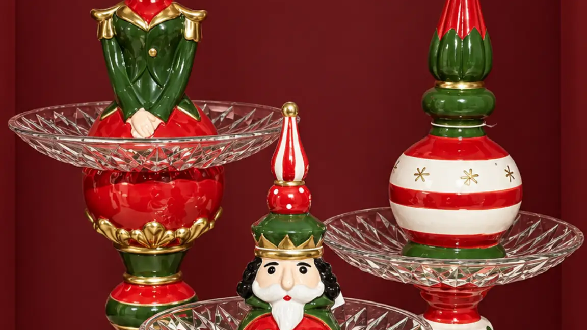
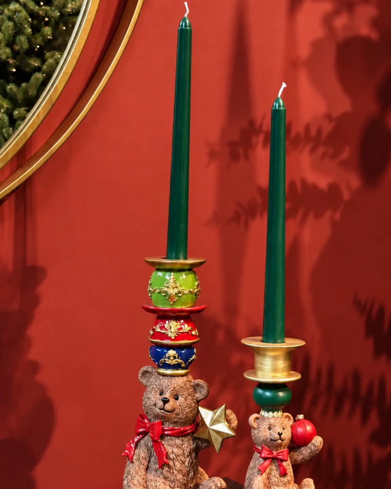
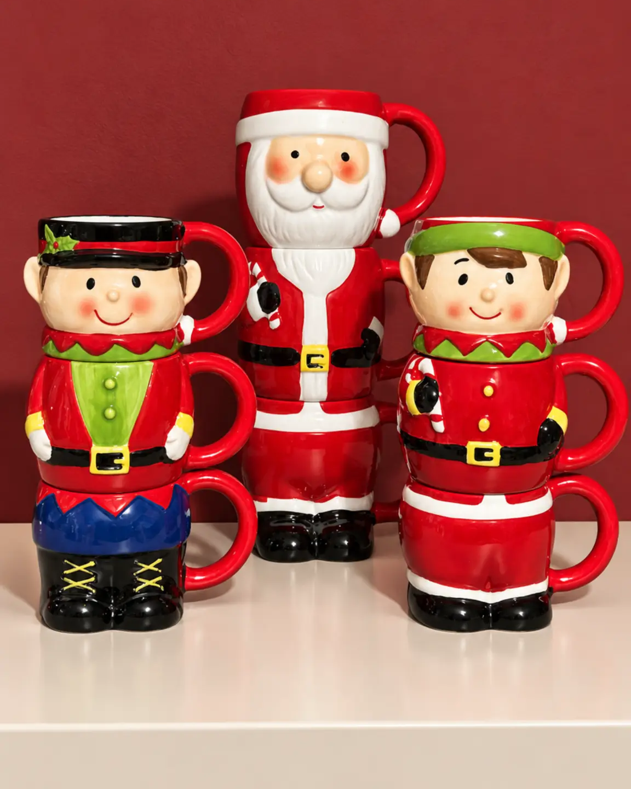
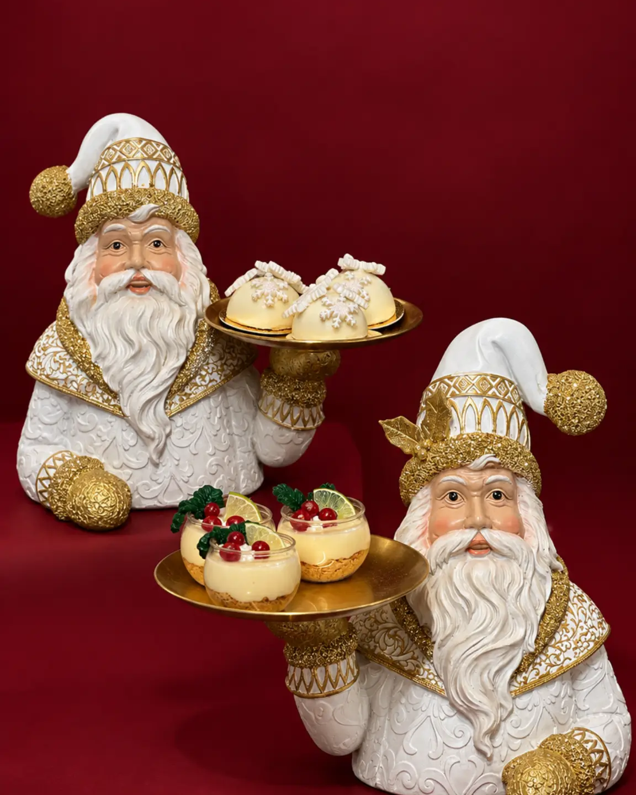

# Cómo decorar una mesa navideña elegante y funcional

<figure class="hero">
  
  <figcaption>Una composición escalonada introduce un punto focal y permite leer la relación entre alturas.</figcaption>
</figure>

<!-- INICIO CUERPO -->
## Introducción

Una mesa navideña bien decorada no depende de acumular adornos. Depende de tomar decisiones claras sobre color, escala, alturas y espacio. Por eso, saber cómo decorar una mesa navideña implica organizar una escena atractiva sin convertir el comedor en una superficie difícil de usar.

La clave es construir un punto focal y dejar que el resto de las piezas lo acompañe. Con una paleta definida y una distribución pensada para la forma de la mesa, la decoración de mesa navideña puede verse especial en una cena familiar y seguir siendo funcional en un espacio profesional.

## Define una intención visual

Empieza por decidir qué sensación quieres comunicar. Una mesa de Navidad elegante puede ser sobria, cálida, tradicional o festiva, pero necesita una dirección reconocible. Elige dos o tres colores principales y un acabado de apoyo. Los tonos rojos pueden aportar una lectura clásica; los dorados, una presencia luminosa; y los neutros, una base serena para que destaque un detalle navideño.

No es necesario que todos los elementos sean idénticos. Basta con repetir un color o un acabado en puntos separados para crear continuidad. Así la decoración para Navidad se siente coordinada, no uniforme. Observa también el ambiente alrededor: la mesa puede dialogar con el árbol o con una consola sin copiar su composición.

## Construye un centro proporcionado

El centro de mesa navideño es el ancla visual, pero no debe bloquear la vista entre comensales. Su tamaño tiene que guardar relación con el largo y el ancho de la superficie. En una mesa rectangular, una pieza central alargada o un grupo controlado puede acompañar el eje. En una mesa redonda, una pieza concentrada ayuda a mantener el equilibrio desde todos los asientos.

Trabaja con tres niveles de presencia: una pieza protagonista, apoyos más bajos y espacios libres. Un centro de dos niveles puede aportar volumen sin extenderse demasiado. Una bandeja puede reunir objetos y facilitar que la escena se mueva como unidad cuando sea necesario despejar. Un portavelas navideño puede sumar verticalidad si no interfiere con la conversación ni el servicio.

La altura debe permitir ver a la persona que está enfrente. Si eliges una pieza alta, ubícala donde no corte el campo de visión o compénsala con elementos bajos. En espacios de atención al público, la decoración debe ser visible sin convertirse en un obstáculo.

<figure class="article-image">
  
  <figcaption>Dos alturas relacionadas aportan verticalidad sin convertir la composición en una barrera visual.</figcaption>
</figure>

## Organiza según la forma y el uso

### Mesa rectangular

Divide mentalmente la superficie en tres zonas: un centro decorativo y dos áreas laterales para el servicio. En una mesa larga, evita pegar todos los objetos a un solo extremo. Puedes usar una pieza protagonista en el centro y repetir un detalle bajo en cada lado, conservando una distancia visual similar. Esta distribución funciona para una cena familiar y para una mesa profesional porque deja una lectura ordenada.

Si la mesa es muy larga, no la llenes con una sucesión de objetos pequeños. Es preferible un grupo central, una separación y un apoyo secundario. La repetición debe crear ritmo, no una fila rígida.

### Mesa redonda

Concentra la decoración en un núcleo que pueda apreciarse desde cualquier asiento. Una bandeja o un centro compacto ayuda a mantener los bordes libres. Evita una composición demasiado ancha: la forma circular ya tiene una presencia fuerte y necesita aire visual alrededor.

Para una cena con varios invitados, reserva el perímetro para platos, copas y elementos de servicio. El centro puede contener un objeto principal acompañado por un detalle bajo. Esta solución también funciona en mesas auxiliares redondas.

### Mesa pequeña o de apoyo

Cuando la superficie es reducida, elige una sola historia visual. Un centro pequeño puede convivir con una pieza de servicio, pero no con muchos objetos independientes. Una tortera o una bandeja puede definir una zona útil y decorativa; una taza navideña puede aportar un acento cotidiano sin saturar.

En un desayunador, una barra de café o una mesa auxiliar, piensa en la circulación. La decoración debe poder retirarse con facilidad y no ocupar el espacio para apoyar una bebida o un plato. La proporción también se nota en lo que decides dejar fuera.

<figure class="article-image">
  
  <figcaption>Una agrupación de tazas puede llevar el acento navideño a una estación de bebidas sin ocupar toda la superficie.</figcaption>
</figure>

## Combina decoración y función

La mesa funciona mejor cuando cada elemento tiene un papel. El centro marca el punto focal; una bandeja agrupa; una tortera presenta; un plato decorativo refuerza el tema; y una taza navideña puede acompañar una estación de bebidas. No necesitas usar todas estas categorías en la misma escena. Selecciona según el momento, el número de personas y la superficie disponible.

Una estrategia sencilla consiste en separar zona decorativa y zona de servicio. En una cena, la decoración puede ir al centro y los apoyos para servir, en un extremo o en una superficie cercana. Simula el uso antes de terminar: revisa si queda espacio para mover una copa, alcanzar una porción y sentarse cómodamente. Una mesa elegante debe funcionar durante la reunión.

<figure class="article-image">
  
  <figcaption>Una pieza elevada puede presentar alimentos y repetir la función a menor altura sin llenar toda la superficie.</figcaption>
</figure>

## Coordina la mesa con el ambiente

La decoración de la mesa no tiene que competir con todo lo que ocurre alrededor. Repite un color del árbol o de una pieza cercana, pero cambia la escala para que cada superficie tenga su propia función. En un comedor con varios focos, una mesa contenida puede ordenar el conjunto.

En una casa, prioriza comodidad y conversación. En un restaurante, hotel, oficina o comercio, considera además la visibilidad, el acceso y los recorridos. La misma lógica sirve para todos: elegir menos piezas y ubicarlas con intención. La colección comercial debe explorarse después de definir tamaño y uso, no al revés.

## Errores frecuentes

Sobrecargar el centro reduce la superficie útil y hace que ninguna pieza destaque. Ignorar la altura dificulta la conversación. Una escala incorrecta puede dominar una mesa pequeña o perderse en una superficie amplia. Repetir objetos sin ritmo genera ruido. Olvidar el servicio produce una mesa adecuada para una fotografía, pero incómoda para una cena. Finalmente, desconectar la paleta del ambiente hace que la escena parezca improvisada.

## Preguntas frecuentes

### ¿Cuál es la altura adecuada para un centro de mesa navideño?

Debe permitir que los comensales se vean y conversen. Si una pieza es alta, ubícala donde no interrumpa la línea de visión o compénsala con elementos bajos.

### ¿Cómo decorar una mesa redonda sin recargarla?

Concentra un grupo compacto en el centro y deja libre el perímetro. Una pieza principal con un apoyo bajo suele ser suficiente para mantener el equilibrio desde todos los asientos.

### ¿Qué hacer en una mesa navideña pequeña?

Elige una sola idea visual y combina decoración con servicio. Una tortera, una bandeja o un centro compacto puede definir la escena sin impedir que la superficie siga siendo útil.

### ¿Cómo conservar espacio para una cena?

Prueba la distribución antes de recibir a los invitados. Separa el punto focal de las zonas de servicio y retira cualquier objeto que impida sentarse, mover una copa o alcanzar un plato.

### ¿Es necesario repetir los colores del árbol en la mesa?

No es obligatorio. Repetir un color o acabado puede conectar los ambientes, pero la mesa también puede tener una paleta propia que dialogue con el comedor.

Una mesa navideña proporcionada se construye con pausas, no con acumulación. Define el ambiente, escoge un punto focal acorde con la forma de la mesa y conserva suficiente superficie para que la reunión fluya. Explora la colección de [Navidad en la Mesa de Anbar Home](https://anbarhome.co/category/navidad-en-la-mesa) para revisar piezas que puedas combinar de acuerdo con el tamaño, el uso y el estilo de tu espacio.
<!-- FIN CUERPO -->
