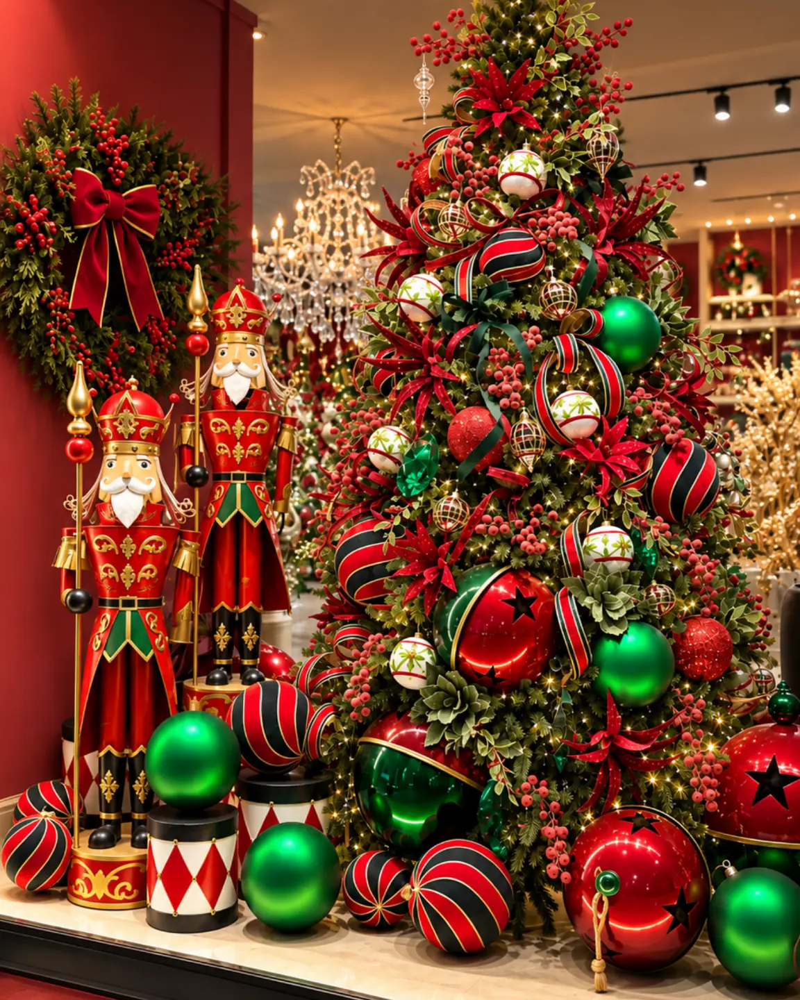
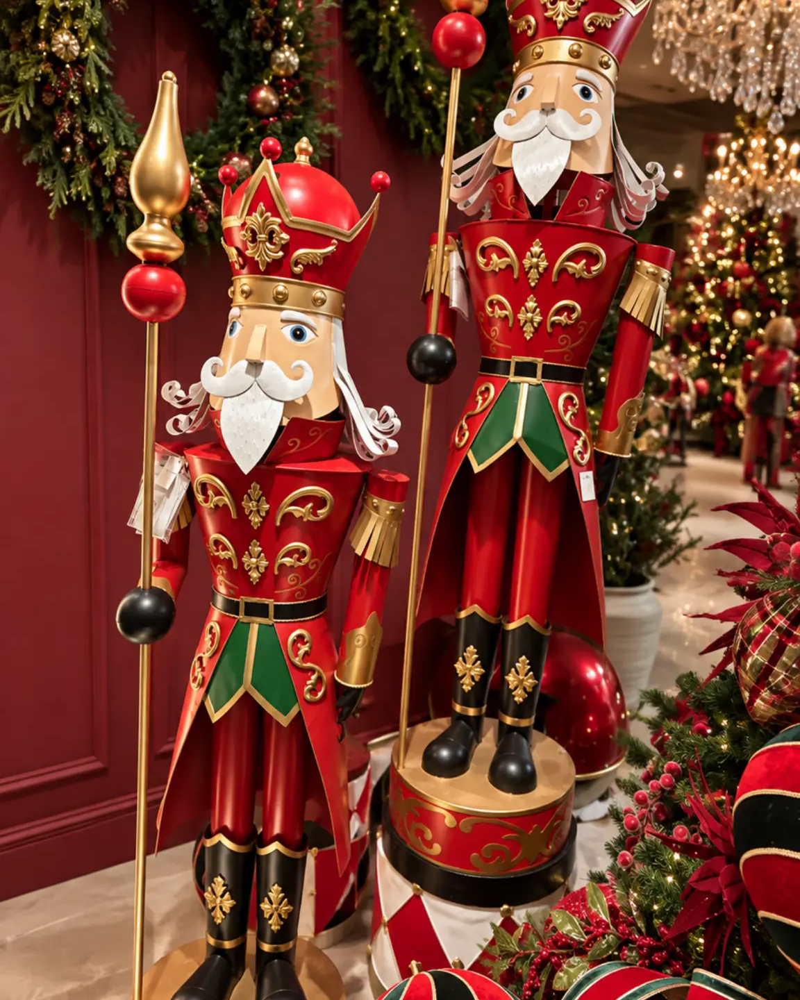

# Decoración navideña para oficinas, hoteles, restaurantes y comercios

<figure class="hero">
  
  <figcaption>Un árbol de presencia vertical puede organizar una exhibición interior y dejar legible el recorrido a su alrededor.</figcaption>
</figure>

<!-- INICIO CUERPO -->
## Introducción

La decoración navideña para oficinas y negocios debe integrarse con la identidad del lugar, respetar la circulación y crear un punto focal que se entienda en pocos segundos. Una recepción, un lobby, una vitrina y un restaurante tienen ritmos de uso distintos. Por eso, una composición que funciona en una casa no debe trasladarse sin ajustes a un espacio de atención al público.

El punto de partida es definir el recorrido y después seleccionar las piezas. Un árbol puede organizar la entrada de una oficina, una villa puede contar una escena en una vitrina y un pesebre puede ocupar una zona institucional sin competir con la operación diaria. Esta guía trata criterios de temporada y especificación; no presenta instalación, montaje o diseño integral como servicios confirmados.

## Lee el espacio, la marca y la circulación

Antes de escoger un elemento, identifica dónde se verá, desde qué ángulos será observado y qué actividades ocurren cerca. En una oficina, la entrada y la zona de espera suelen concentrar la atención. En un hotel, el lobby debe conservar una lectura amplia para huéspedes, equipaje y personal. En un restaurante, la decoración no debe invadir la recepción ni dificultar la limpieza. En un comercio, la vitrina debe atraer miradas sin ocultar el producto o el acceso.

Define una paleta relacionada con el ambiente existente. Una base neutra admite acentos tradicionales. Una oficina con identidad visual definida necesita que los tonos navideños acompañen su lenguaje. Repetir pocos colores ayuda a que el proyecto se perciba intencional y evita que cada zona parezca pertenecer a una temporada distinta.

La escala también debe responder al edificio. Una recepción alta puede sostener un árbol de presencia vertical, mientras un pasillo estrecho necesita una pieza más contenida. El Árbol Navideño Aspen Slim aparece en la auditoría como referencia para espacios profesionales; su medida, base y uso deben revisarse directamente en la ficha antes de especificarlo. La colección de [Árboles de Navidad de Anbar Home](https://anbarhome.co/category/arboles-de-navidad) permite comparar formatos comerciales.

## Ideas según el tipo de negocio

### Oficinas: una bienvenida clara

Concentra la decoración en la recepción, la sala de espera o un punto que no interfiera con puertas, ascensores y rutas de evacuación. Un árbol de Navidad para oficina puede funcionar como foco principal si deja una franja libre alrededor y se aprecia desde el acceso. Evita llenarlo de elementos sin relación; una paleta corta y una distribución equilibrada comunican mejor que la acumulación.

En oficinas con varias áreas, repite un recurso en menor escala. El árbol puede estar en recepción y una escena complementaria en una consola de espera. Basta con trasladar un color o textura para conectar el conjunto. Si el lugar recibe clientes, prioriza una imagen ordenada y fácil de revisar durante la temporada.

### Hoteles: una secuencia desde el acceso

La decoración navideña para hoteles debe leerse como una secuencia. El acceso anuncia la temporada; la recepción confirma el tono; el lobby desarrolla el foco. En vez de repartir piezas al azar, selecciona una escena principal y dos apoyos que acompañen el recorrido sin repetir la misma imagen.

Las villas o pueblos navideños pueden ocupar una consola, una vitrina o una superficie con distancia de lectura. La colección de Villas navideñas reúne escenas que deben evaluarse por superficie y visibilidad. Si una ficha confirma iluminación, planifica la conexión y organiza los cables sin crear obstáculos. En zonas de tránsito, la base debe permanecer estable y fuera del paso de equipaje o carros.

<figure class="article-image">
  
  <figcaption>Una intervención mural contenida puede anunciar la temporada desde el acceso sin ocupar el recorrido.</figcaption>
</figure>

### Restaurantes: ambientar sin competir

En un restaurante, el mejor punto suele estar en el acceso, la recepción o un muro lateral visible mientras las personas esperan. En el comedor, la composición debe convivir con mesas, sillas y circulación del equipo. Evita una pieza alta que bloquee la conversación o sobresalga hacia el recorrido.

Un árbol estilizado puede marcar la entrada cuando el espacio es limitado. En restaurantes amplios, una pieza escenográfica lateral crea profundidad sin convertir cada mesa en un punto decorativo. Mantén relación entre la paleta navideña y los acabados del lugar, y reserva los detalles llamativos para un único foco.

### Comercios y vitrinas: comunicar una escena

La decoración de Navidad para comercios debe funcionar desde el exterior y desde distintos ángulos. Organiza la vitrina con fondo, plano medio y primer plano; deja zonas de respiración para conservar visible el producto o el mensaje principal. Una aldea o un pueblo puede contar una historia, mientras un árbol establece la altura.

En espacios con alto flujo, separa la escenografía del recorrido. La colección de [Pesebres y nacimientos](https://anbarhome.co/category/pesebres-y-nacimientos) puede ser pertinente para una escena institucional o cultural cuando la superficie, el contexto y la ficha de cada pieza lo respalden. La decoración para Navidad en espacios comerciales debe ser visible, comprensible y operativa.

<figure class="article-image">
  
  <figcaption>En una vitrina, una escena vertical y contrastada puede atraer la mirada sin depender de identificar un producto por nombre comercial.</figcaption>
</figure>

## Tres esquemas de distribución

**Oficina con recepción compacta.** Ubica un árbol estilizado en un lateral, nunca frente a la puerta. En la consola de espera, repite un acento de color y conserva libre la superficie de atención.

**Lobby de hotel.** Reserva la mayor altura para la pieza principal. En una consola posterior, ubica una escena de villa visible desde el acceso. Deja un corredor continuo entre entrada, recepción y ascensores.

<figure class="article-image">
  
  <figcaption>Repetir alturas y un color dominante puede crear un punto focal legible en una recepción o lobby.</figcaption>
</figure>

**Vitrina de comercio.** Coloca la escena en un plano lateral y deja un área despejada para el producto destacado. Eleva algunos elementos sin ocultar el interior ni la señalización.

## Operación y seguridad visual

Una propuesta atractiva debe poder revisarse durante la temporada. Define quién verificará estabilidad, polvo, conexiones y superficies. No cubras señalización, extintores, salidas ni accesos. Evita golpes, puntas y cables expuestos. Las fotografías y las fichas pueden orientar la selección, pero las condiciones reales del establecimiento deben prevalecer.

La auditoría confirma que Anbar Home presenta asesoría personalizada, pedidos por encargo y colaboración con estudios de arquitectura, interioristas y directores de proyectos en determinados contextos [33] [42]. Esa información no equivale a un servicio confirmado de instalación o montaje navideño en sitio. El alcance concreto debe validarse directamente antes de comunicarlo en una propuesta profesional.

Para el contexto permanente de diseño corporativo puede consultarse [Quiet Luxury en interiores corporativos](https://www.anbarhome.co/blog/quiet-luxury-en-interiores-corporativos). Esta guía nueva se diferencia porque trata la temporada, las familias de producto, los sectores y la operación del recorrido.

## Errores frecuentes

Elegir por tamaño sin medir puede hacer que una pieza adecuada para un lobby sea desproporcionada en una recepción. Bloquear recorridos afecta la experiencia y la operación. Mezclar árbol, villa, pesebre y figuras sin jerarquía confunde la escena. Copiar una composición residencial ignora usuarios, horarios y tareas del negocio. Ignorar la vista lateral deja cables o respaldos expuestos. Finalmente, prometer instalación o montaje sin confirmación convierte una recomendación editorial en una afirmación comercial no verificada.

## Preguntas frecuentes

### ¿Cómo elegir un árbol de Navidad para oficina?

Mide la altura libre, el ancho disponible y la distancia de observación. Después decide si conviene un formato estilizado o uno de mayor volumen. La prioridad es que funcione como foco sin afectar acceso, atención ni circulación.

### ¿Dónde ubicar decoración navideña en un hotel?

La recepción, el lobby y las consolas cercanas al acceso suelen ofrecer visibilidad si no reducen el paso. Organiza una escena principal y complementos menores; revisa el conjunto desde ingreso, mostrador y rutas hacia ascensores o salones.

### ¿Qué piezas funcionan en una vitrina comercial?

Depende de la superficie y del mensaje que deba permanecer visible. Villas, pueblos, árboles y otras piezas escenográficas pueden formar una escena, pero conviene limitar protagonistas, trabajar alturas y dejar espacio negativo.

### ¿Cómo decorar un restaurante sin afectar las mesas?

Prioriza acceso, recepción o muro lateral. Mantén despejadas las áreas de servicio y evita piezas que invadan conversación o paso. Un solo foco bien ubicado suele ser más claro que varios adornos sin relación.

### ¿Anbar Home instala la decoración navideña?

La auditoría revisada no confirmó un servicio de instalación, montaje o desmontaje en sitio. La existencia de asesoría personalizada o colaboración profesional no debe comunicarse como instalación. Confirma el alcance específico directamente con Anbar Home.

La decoración navideña para oficinas, hoteles, restaurantes y comercios se resuelve mejor cuando cada decisión parte del uso real. Mide, define una jerarquía, selecciona una paleta coherente y deja que la circulación determine la ubicación. Explora las colecciones navideñas de Anbar Home, comenzando por [Villas navideñas](https://anbarhome.co/category/villas-navidenas), para comparar escenas según la escala y el carácter de tu proyecto.
<!-- FIN CUERPO -->

[33]: https://www.anbarhome.co/nosotros "Nuestra Historia de Anbar Home"
[42]: https://www.anbarhome.co/preguntas-frecuentes "Preguntas frecuentes de Anbar Home"
