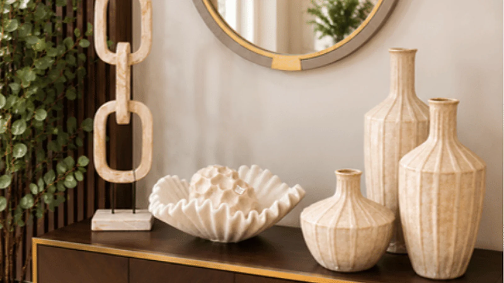
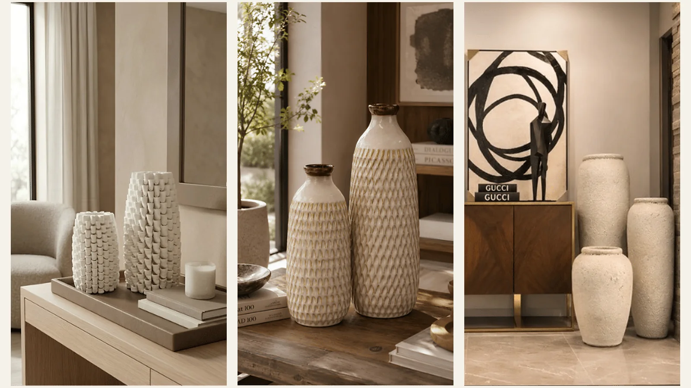
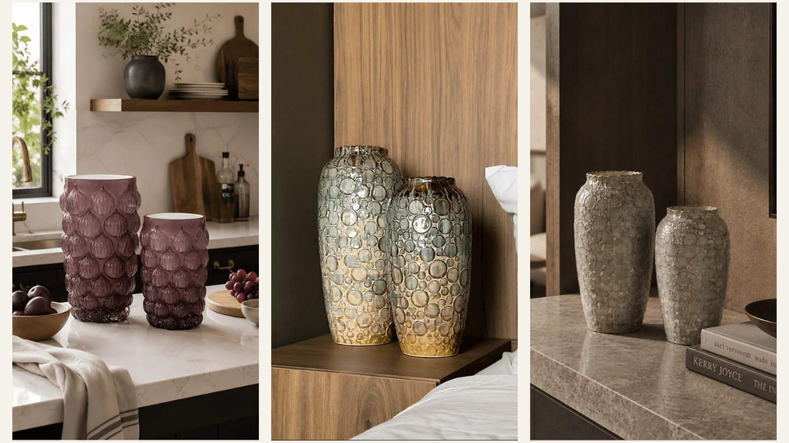
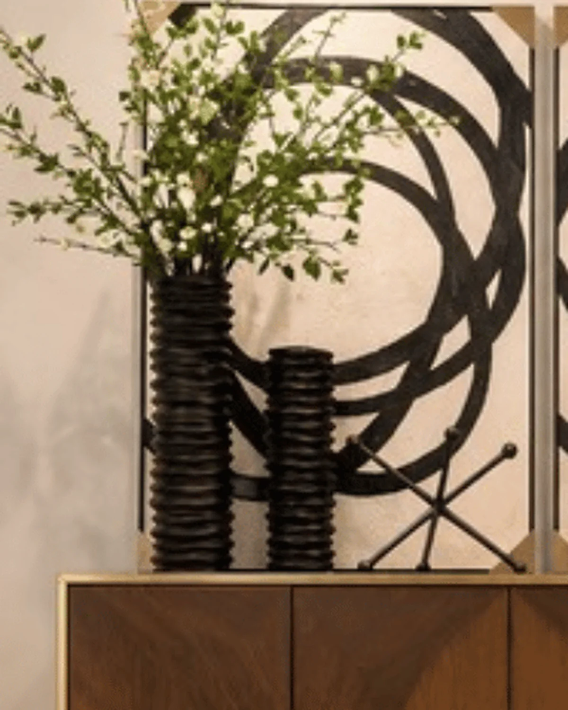
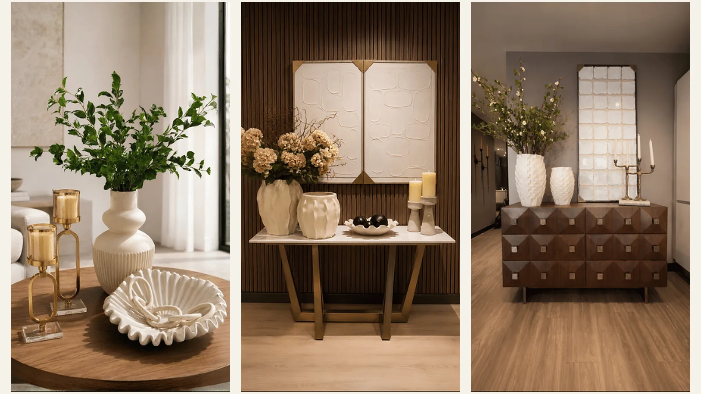

# Cómo elegir jarrones decorativos según el espacio

*La escala del jarrón debe guardar relación con la superficie y el espacio disponible.*

Saber cómo elegir jarrones decorativos ayuda a evitar dos problemas frecuentes: comprar una pieza que se ve pequeña frente al mueble o elegir una composición que ocupa demasiado espacio. Antes de decidir por el color o la forma, conviene revisar las medidas, la ubicación y el efecto visual que se busca.

El criterio cambia según el ambiente. Una mesa auxiliar necesita una pieza distinta a la de una consola amplia, un recibidor, una oficina o un lobby. Esta guía reúne pautas prácticas para comparar tamaños, acabados y formas de uso sin depender de una tendencia específica.

## Cómo elegir jarrones decorativos por tamaño

Mide el ancho, el fondo y la altura de la superficie donde irá el jarrón. La base debe quedar completamente apoyada y debe existir espacio libre alrededor. Si el jarrón llevará flores o ramas, calcula también la altura total de la composición para comprobar que no cubra un cuadro, un espejo, una ventana o una señal dentro de un espacio comercial.

La vista frontal no es suficiente. Revisa el jarrón desde el recorrido habitual del ambiente y confirma que no interfiera con puertas, zonas de paso o elementos que se usan a diario.

### Jarrones pequeños

Funcionan bien en mesas auxiliares, mesas de noche, escritorios y repisas. Pueden acompañarse con libros o cajas decorativas, siempre que mantengan una diferencia visible de altura. En superficies estrechas es preferible una pieza estable y con una base que no quede al borde.

### Jarrones medianos

Son una opción útil para consolas, aparadores y mesas de centro amplias. Un diseño con suficiente presencia puede utilizarse sin flores. Si se combina con otros objetos, debe conservar un área libre que permita apreciar su silueta.

### Jarrones grandes

Pueden ubicarse sobre muebles profundos o directamente en el piso. Antes de instalarlos, verifica su estabilidad y el espacio de circulación. En recibidores, oficinas, hoteles y locales comerciales también conviene observar la pieza desde la entrada para revisar su proporción frente al muro y al mobiliario.

*Comparar varias alturas ayuda a elegir una pieza proporcionada para mesas, consolas o el piso.*

## Cómo elegir el acabado y la textura

El acabado modifica la forma en que el jarrón se relaciona con los materiales cercanos. Una pieza mate puede crear contraste sobre una superficie brillante. Un acabado reflectante recibe más atención y cambia según la iluminación. Los relieves proyectan pequeñas sombras y se perciben mejor cuando el fondo no compite con ellos.

Antes de elegir, revisa la ficha del producto para conocer el material y los cuidados recomendados. No todas las piezas decorativas están diseñadas para contener agua. Si se van a utilizar flores naturales, debe confirmarse que el recipiente admita líquidos o que pueda incorporar un contenedor interno sin afectar su acabado.

En proyectos residenciales o profesionales, compara el jarrón con muestras del entorno: madera, piedra, textiles, pintura y metales. La decisión será más precisa que elegirlo de manera aislada.

*El relieve, el brillo y el color cambian la manera en que el jarrón se integra con los materiales cercanos.*

## Jarrones con flores, ramas o sin contenido

Un jarrón escultórico puede funcionar como objeto decorativo sin relleno. Esta opción permite apreciar la forma completa y resulta útil cuando el entorno ya tiene varios patrones o accesorios.

Si se utilizan ramas, su altura debe mantener una relación visual con el recipiente y el techo. Distribúyelas sin ocultar por completo la silueta del jarrón. Frente a un espejo o una obra de arte, comprueba que el follaje no cubra el punto focal ni genere una masa visual difícil de leer.

Para mesas de comedor, la altura total también debe permitir la conversación entre las personas sentadas. En consolas y aparadores, puede utilizarse una composición más alta si no interfiere con luminarias, cuadros o circulación.

*Las ramas acompañan la altura de los jarrones sin ocultar por completo la composición del fondo.*

## Cómo combinar varios jarrones

Busca un vínculo claro entre las piezas: color, acabado, forma o lenguaje visual. No necesitan ser idénticas. Una combinación se entiende mejor cuando existe una pieza principal y las demás funcionan como apoyo.

Usa alturas distintas y acerca las bases para que el conjunto se lea como una sola composición. Evita distribuir los jarrones a distancias iguales o formar una fila rígida. Adelantar ligeramente una pieza puede aportar profundidad sin ocupar más superficie.

Si los jarrones tienen relieves marcados, reduce la cantidad de accesorios cercanos. Si son más sencillos, pueden acompañarse con una bandeja, libros u otro objeto de menor escala. La selección debe dejar zonas de descanso visual.

## Qué jarrón elegir para cada espacio

### Sala

En una mesa de centro, el jarrón debe dejar una parte útil de la superficie. Sobre una consola o un mueble de televisión puede tener mayor altura, siempre que no cubra la pantalla, el arte o el espejo. Para ampliar este criterio, consulta la guía de Anbar Home sobre [cómo decorar una sala sin recargarla](https://www.anbarhome.co/blog/como-decorar-una-sala-sin-recargarla).

### Comedor

Si el jarrón permanece en la mesa durante las comidas, revisa que no bloquee la conversación. Una pieza más alta puede funcionar en un aparador cercano, donde tenga suficiente fondo y no interfiera con el servicio.

### Recibidor

Elige una pieza visible desde la entrada y proporcionada con la consola. Revisa la apertura de la puerta, el paso de las personas y la distancia frente al espejo. Una composición alta puede dirigir la mirada, pero necesita aire alrededor.

### Oficina, hotel o espacio comercial

En proyectos profesionales, la escala debe evaluarse desde varios puntos de circulación. En una recepción o lobby, un jarrón puede ayudar a organizar el punto focal. En una sala de reuniones o un escritorio compartido, debe conservar la visibilidad y el área de trabajo.

### Repisas y piso

Para repisas, utiliza formatos que permitan dejar espacio libre en cada nivel. En el piso, escoge una base estable y ubica la pieza fuera de recorridos, puertas y zonas de limpieza frecuente.

*La ubicación cambia la escala necesaria y la forma de combinar el jarrón con los objetos cercanos.*

## Errores frecuentes al elegir jarrones

- Elegir solo por color sin revisar las medidas.
- Comprar un jarrón estrecho para un volumen de ramas que necesita mayor soporte.
- Usar varias piezas de la misma altura en una fila rígida.
- Colocar un jarrón grande sobre una superficie poco profunda.
- Añadir agua sin confirmar que el recipiente sea apto para líquidos.
- Ubicar una pieza de piso dentro de una ruta de circulación.
- Combinar demasiados acabados y accesorios en una sola superficie.

## Lista de verificación antes de comprar

1. Mide el ancho, el fondo y la altura disponibles.
2. Define si el jarrón irá solo, con flores o con ramas.
3. Revisa el material, el acabado y las instrucciones de cuidado.
4. Comprueba la estabilidad y el espacio de circulación.
5. Compara la pieza con los colores y materiales cercanos.
6. Decide qué objeto tendrá la mayor jerarquía visual.
7. Conserva las medidas del espacio durante la selección.

## Preguntas frecuentes sobre cómo elegir jarrones decorativos

### ¿El jarrón debe combinar con el sofá?

No necesita repetir exactamente su color. Puede relacionarse con cojines, cortinas, arte, mesas o acabados del ambiente. También puede crear contraste si ese tono aparece en otro punto de la composición.

### ¿Se pueden mezclar jarrones con acabados diferentes?

Sí, cuando existe un vínculo visible entre las piezas. Puede ser la forma, la paleta o la proporción. Conviene elegir una pieza principal y limitar la cantidad de materiales que compiten en la misma superficie.

### ¿Cómo saber si un jarrón es demasiado grande?

Observa si ocupa casi todo el fondo del mueble, cubre elementos importantes o dificulta el uso de la superficie. También debe verse completo desde la distancia habitual y conservar espacio libre a su alrededor.

### ¿Cuántos jarrones se pueden colocar juntos?

Depende del tamaño de la superficie. Dos o tres piezas con alturas diferentes suelen permitir una composición clara, pero el criterio principal es que las bases estén seguras y que todavía exista espacio libre.

## Elige con las medidas del espacio

La decisión debe comenzar por el lugar donde irá la pieza. Conserva las medidas, define si utilizarás ramas o flores y compara la escala desde el recorrido habitual del ambiente. Puedes explorar la colección de [jarrones escultóricos de Anbar Home](https://www.anbarhome.co/category/jarrones-escultoricos) para revisar opciones disponibles y contrastarlas con tu espacio.

